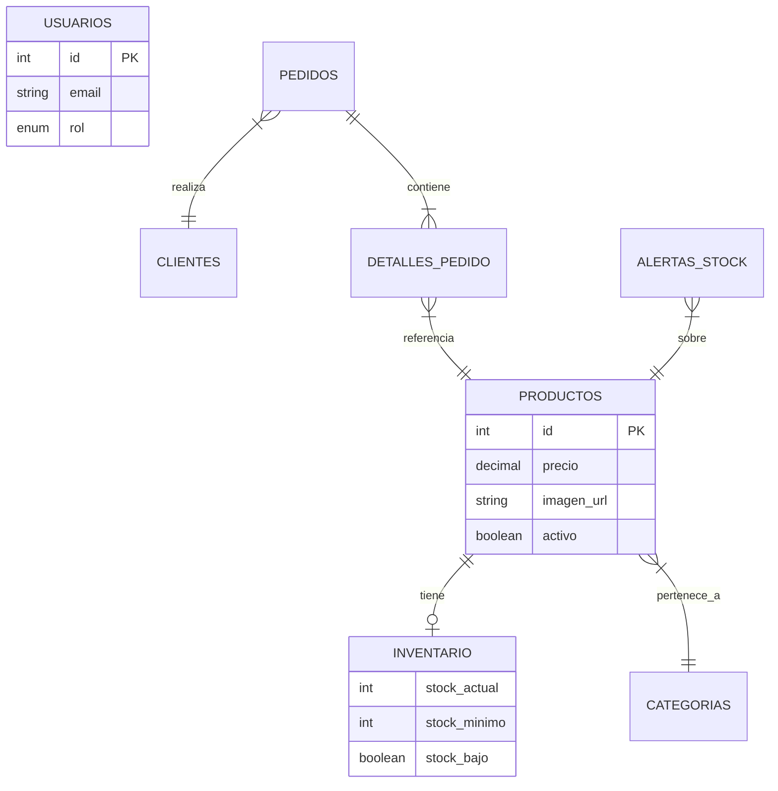

# LoopMe - Documentación Técnica del Sistema

## Índice

1. [Introducción y Descripción General](#introducción-y-descripción-general)
2. [Arquitectura del Sistema](#arquitectura-del-sistema)
3. [Tecnologías Utilizadas](#tecnologías-utilizadas)
4. [Estructura del Proyecto](#estructura-del-proyecto)
5. [Módulos del Sistema](#módulos-del-sistema)
6. [Flujo de Datos y Entidades](#flujo-de-datos-y-entidades)
7. [Base de Datos](#base-de-datos)
8. [Configuración y Despliegue](#configuración-y-despliegue)

---

##Introducción y Descripción General

**LoopMe** es una plataforma integral de comercio electrónico y gestión de inventario diseñada para operar como una solución completa que abarca desde la experiencia de compra del cliente hasta la administración interna de productos y ventas.

El sistema funciona bajo una arquitectura **Cliente-Servidor**, donde el frontend (interfaz de usuario) se comunica con una API RESTful centralizada alojada en un servidor Node.js. El núcleo del sistema gestiona la autenticación de usuarios (roles de Administrador, Vendedor, Inventario y Cliente), procesamiento de pedidos, control de stock en tiempo real mediante triggers de base de datos y generación de reportes administrativos.

### Propósito del Documento
Este documento técnico está dirigido a desarrolladores y administradores de sistemas. Su objetivo es detallar la estructura interna, los flujos de información y los componentes lógicos que posibilitan la operatividad de LoopMe.

---

## Arquitectura del Sistema

La solución implementa una arquitectura monolítica modularizada con separación lógica entre capas de presentación, negocio y persistencia.

```mermaid
graph TD
    subgraph Client_Side ["Capa de Cliente (Frontend)"]
        PublicUI[Tienda Pública / E-commerce]
        AdminUI[Panel de Administración]
    end

    subgraph Server_Side ["Capa de Servidor (Backend)"]
        API_Gateway[Express Router / API Gateway]
        Auth_Layer[Middleware de Autenticación JWT]
        Business_Logic[Controladores de Negocio]
        Static_Server[Servidor de Archivos Estáticos]
    end

    subgraph Persistence_Layer ["Capa de Persistencia"]
        MySQL_DB[(Base de Datos MySQL)]
        FileSystem[Almacenamiento Local (Imágenes)]
    end

    PublicUI -->|HTTP Requests| API_Gateway
    AdminUI -->|HTTP Requests / Auth| API_Gateway
    API_Gateway --> Auth_Layer
    Auth_Layer --> Business_Logic
    Business_Logic -->|SQL Queries| MySQL_DB
    Business_Logic -->|File I/O| FileSystem
    Static_Server -->|Serve Clients| Client_Side
```

---

## Tecnologías Utilizadas

*   **Runtime Environment**: Node.js
*   **Framework Backend**: Express.js
*   **Base de Datos**: MySQL
*   **Autenticación**: JSON Web Tokens (JWT) & bcrypt
*   **Frontend**: HTML5, CSS3, JavaScript (Vanilla)
*   **Manejo de Archivos**: Multer
*   **Generación de Documentos**: jsPDF, html2canvas
*   **Pagos**: Stripe API Integration

---

## Estructura del Proyecto

El proyecto sigue una estructura semántica donde el código backend y frontend se encuentran claramente diferenciados.

```bash
LoopMe/
├── backend/                  # Lógica del servidor y API
│   ├── middleware/           # Middlewares (Auth, CORS, Roles)
│   ├── routes/               # Definición de rutas de la API
│   ├── db.js                 # Configuración de conexión a BD
│   ├── multerConfig.js       # Configuración de subida de archivos
│   ├── server.js             # Punto de entrada principal
│   └── *.js                  # Scripts de utilidades y migración
├── fronted/                  # Código fuente del cliente
│   ├── admin/                # SPA para el panel administrativo
│   │   ├── *.html            # Vistas administrativas
│   │   └── ...
│   ├── public/               # Tienda pública accesible a clientes
│   │   ├── *.html            # Vistas de la tienda
│   │   ├── css/              # Estilos globales
│   │   ├── js/               # Lógica de cliente
│   │   ├── img/              # Assets gráficos
│   │   └── uploads/          # Directorio de imágenes de productos
├── sql.sql                   # Script de definición de esquema BD
├── package.json              # Dependencias y scripts del proyecto
└── readme.md                 # Documentación técnica
```

---

## Módulos del Sistema

### 1. Servidor Principal (`server.js`)
Punto de entrada que inicializa la aplicación Express. Configura:
*   **CORS**: Permite peticiones cruzadas controladas.
*   **Static Serving**: Sirve los archivos del frontend (`/public`, `/admin`) y las imágenes subidas (`/uploads`).
*   **Routing**: Delega las peticiones a los sub-routers en `/api`.

### 2. Gestión de Productos (`routes/products.js`)
Módulo encargado del ciclo de vida de los productos.
*   **Entradas**: Datos `multipart/form-data` (texto + imagen).
*   **Proceso**:
    *   Valida tipos de datos y permisos de administrador.
    *   Guarda la imagen en disco mediante Multer.
    *   Actualiza las tablas `productos` e `inventario` transaccionalmente.
*   **Salidas**: JSON con el estado de la operación y el objeto creado/actualizado.

### 3. Autenticación y Autorización
Utiliza JWT para proteger rutas sensibles.
*   **Middleware `auth.js`**: Verifica la firma y validez del token en el header `Authorization`.
*   **Middleware `isAdmin.js`**: Verifica que el rol del usuario decodificado sea 'Administrador'.

### 4. Sistema de Inventario y Alertas
Lógica híbrida entre aplicación y base de datos.
*   **Triggers de BD**:
    *   `tr_update_stock_after_sale`: Reduce stock automáticamente al crear detalles de pedido.
    *   `tr_mark_low_stock`: Marca automáticamente el flag de "Stock Bajo" si cruza el umbral definido.

### 5. Reportes
Generación de informes para la toma de decisiones.
*   Implementación en frontend (`reportes.html`) que consume datos agregados del backend.
*   Funcionalidad de exportación a PDF utilizando librerías de cliente para renderizar tablas y gráficos.

---

## Flujo de Datos y Entidades

### Entidades Principales

| Entidad | Descripción | Atributos Clave |
| :--- | :--- | :--- |
| **Usuario** | Operadores del sistema administrativo. | `id`, `email`, `password` (hash), `rol`. |
| **Cliente** | Usuarios finales de la tienda. | `id`, `email`, `password`, `datos_envio`. |
| **Producto** | Artículos a la venta. | `id`, `precio`, `categoria_id`, `imagen_url`. |
| **Inventario** | Estado del stock de un producto. | `producto_id`, `stock_actual`, `stock_minimo`. |
| **Pedido** | Transacción de compra. | `id`, `cliente_id`, `estado`, `total`. |

### Flujo de Creación de Pedido (Checkout)
1.  **Entrada**: Cliente envía `POST /api/orders` con lista de productos y datos de envío.
2.  **Validación**: Backend verifica stock disponible para cada ítem.
3.  **Persistencia**:
    *   Se crea registro en `pedidos`.
    *   Se insertan `detalles_pedido`.
4.  **Autómata BD**: Trigger `tr_update_stock_after_sale` desconta stock y genera alerta si es necesario.
5.  **Respuesta**: ID de pedido y confirmación para redirección a pasarela/éxito.

---

## Base de Datos

El sistema utiliza MySQL con motor **InnoDB** para garantizar integridad referencial. El esquema se define en `sql.sql`.

### Diagrama ER (Simplificado)



---

## ⚙ Configuración y Despliegue

### Requisitos Previos
*   Node.js v14+
*   MySQL Server 5.7+ o 8.0+

### Variables de Entorno (.env)
Crear un archivo `.env` en `backend/` con las siguientes claves:

```env
PORT=3000
DB_HOST=localhost
DB_USER=root
DB_PASSWORD=tu_password
DB_NAME=loopme
JWT_SECRET=tu_secreto_seguro
STRIPE_SECRET_KEY=sk_test_...
```

### Pasos de Instalación

1.  **Base de Datos**: Importar `sql.sql` en su servidor MySQL para crear esquema y datos semilla.
    ```sql
    source /ruta/a/LoopMe/sql.sql;
    ```
2.  **Dependencias**: Instalar paquetes NPM.
    ```bash
    npm install
    ```
3.  **Ejecución**:
    *   Modo desarrollo: `npm run dev` (si script configurado) o `node backend/server.js`.
    *   El servidor iniciará en `http://localhost:3000`.

### Verificación
*   Acceder a `http://localhost:3000/admin` para panel administrativo (Credenciales por defecto en `sql.sql`).
*   Acceder a `http://localhost:3000/` para ver la tienda pública.